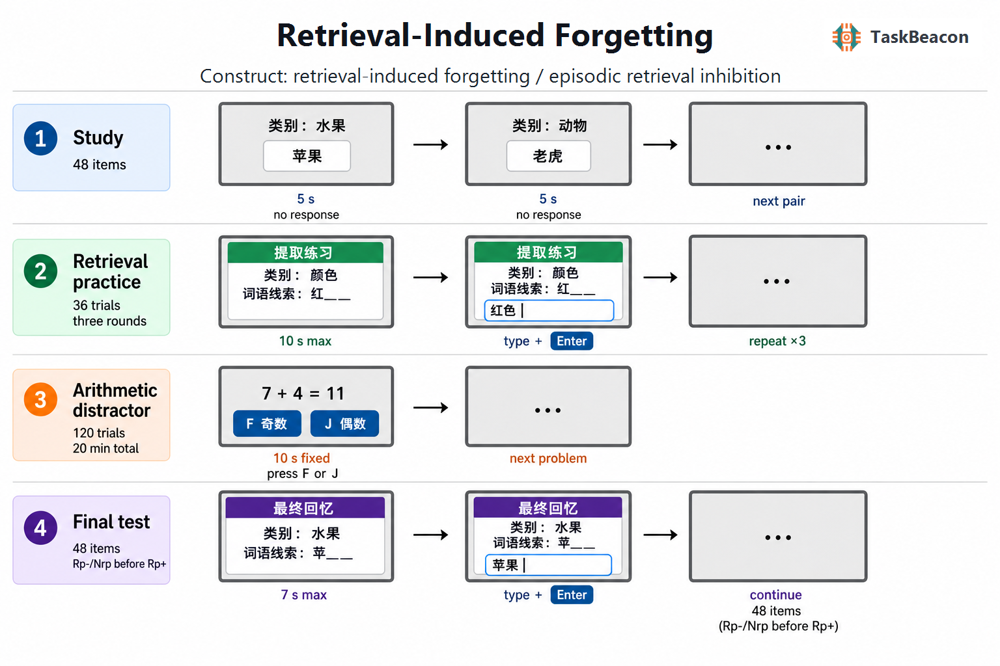

# 选择性提取如何重塑记忆可及性：提取诱发遗忘范式的理论、证据与测量边界

长时记忆中的信息通常共享语义或情境线索，因此目标记忆的提取需要在多个候选表征之间完成选择。提取一方面强化被成功回忆的内容，另一方面可能降低相关但未被提取内容的后续可及性。提取诱发遗忘（retrieval-induced forgetting, RIF）范式以受控的选择性提取操作分离这两种后果：练习项目的保持优势反映提取促进，未练习竞争项目相对于基线项目的损失则构成 RIF。该范式由此把“遗忘”从单纯的时间衰退或新旧学习干扰，转化为可以定位到提取阶段的实验效应，并为检验记忆选择、竞争解决和认知控制之间的关系提供了操作化工具（Anderson et al., 1994; Murayama et al., 2014）。

## 1. 范式提出与理论背景

Anderson 等（1994）以类别—范例材料建立了经典提取练习范式。被试先学习若干语义类别及其范例，随后只反复提取一半类别中的一半范例；最终测验中，已练习项目的回忆优于基线，而同一练习类别内未被练习的项目低于未练习类别项目。后一个差异表明，提取会改变相关记忆的后续可及性，并且该损失可在约 20 分钟的填充间隔后保留。原研究还通过控制最终测验的输出顺序，降低了“先回忆较强 Rp+ 项目、再阻塞 Rp− 项目”的即时输出干扰解释。

抑制解释将选择性提取视为竞争解决过程。类别线索激活多个范例；目标项目被提取时，具有竞争性的非目标表征受到控制性抑制，其后续可及性因而下降。该解释提出三类关键判据：遗忘应由提取而非单纯再学习引起；竞争越强，越可能招致控制；若项目表征本身受到抑制，改用独立线索测验时仍应观察到损失（Anderson & Spellman, 1995; Anderson, 2003）。竞争性提取相较非竞争性提取产生更大遗忘，为提取阶段控制提供了早期证据（Anderson et al., 2000）。

RIF 的行为模式并不唯一指向抑制。强度或阻塞解释认为，Rp+ 与类别线索的联结经练习增强，最终测验时可能挤占 Rp− 的检索机会；情境解释则把学习、提取练习与最终测验中的情境变化和恢复作为决定因素（Jonker et al., 2013）。三类理论对最终线索、测验顺序、再学习控制和练习情境的预测不同。因而，标准的 `Nrp − Rp−` 差值可以确认选择性提取后的相对遗忘，却不能单独识别产生该差值的过程。

## 2. 任务逻辑、流程与核心测量

经典范式包含学习、提取练习、填充间隔和最终测验。学习阶段呈现类别—范例配对。提取练习阶段从一半类别中选择一半范例，以“类别＋词干”要求被试主动生成目标，通常重复三轮。该操作形成三种项目：练习类别中的已练习项目（Rp+）、练习类别中的未练习项目（Rp−），以及未练习类别中的项目（Nrp）。填充任务将练习与测验分隔，减少即时短时保持的贡献。最终测验覆盖全部学习项目，常采用类别线索或类别加词首线索的提示回忆（Anderson et al., 1994; Storm et al., 2015）。

主要因变量是最终测验正确率。提取促进量为 `Rp+ − Nrp`，RIF 指数为 `Nrp − Rp−`；前者检验练习目标的增强，后者比较两个均未接受练习的条件。正确反应时可补充描述提取效率，但应限定在正确试次并与正确率共同解释。练习成功率、超时率和各条件的基线水平也需报告，因为练习失败会削弱预期的竞争操作，接近地板或天花板的最终表现会压缩差值。

阶段构念应依据操作而区分。学习表现受到编码质量和类别—范例典型性影响；提取练习中的正确生成涉及线索驱动搜索、目标选择、竞争和反应输出；Rp+ 优势反映重复提取后的增强；Rp− 相对 Nrp 的下降才是 RIF 的直接行为对比。最终测验再次引入线索有效性、输出竞争和决策标准，因此其差值不是提取阶段抑制强度的纯测量。经典范式没有依据表现改变难度的阶梯或自适应控制，条件分配通常通过材料轮换和被试间反平衡实现。试次反馈并非定义 RIF 所必需的操作；加入正确答案反馈可能同时改变 Rp+ 强度及相关项目的再激活，需要作为独立因素处理。

## 3. 主要行为与神经科学证据

### 3.1 行为效应及其边界条件

元分析显示，标准提取练习范式中的 Rp− 损失在研究间具有稳定的群体平均效应，但效应量受材料、类别结构、练习形式、最终测验和延迟影响（Murayama et al., 2014）。典型性较高或竞争较强的范例更容易出现 RIF，符合竞争触发控制的预期；整合性编码、相关项目共同再激活以及某些独立线索测验则可能减弱效应。练习带来的 Rp+ 增强与 Rp− 损失不宜视为同一过程的镜像，两者可在实验操控下分离。

近期研究进一步支持这种分离。Mulligan 等（2022）发现，提取练习期间的分心削弱或消除了 RIF，却较少损害练习项目的最终保持，说明负性后果比提取促进更依赖练习阶段的注意资源。Kovacs 和 Harris（2022）以新异视觉形状和连续评分提高记忆强度测量的分辨率；主动复制显著强化练习项目却未引起相关项目遗忘，而主动提取产生 RIF，且未发现遗忘量随练习增益变化的证据。这些结果支持提取特异性，但不能排除所有阻塞或情境机制，因为不同测验仍可能混合多种来源。

抑制的“线索独立性”证据尤其需要审慎处理。Anderson 和 Spellman（1995）使用替代线索观察到相关项目受损，支持项目表征层面的变化；后续高功效复现却发现标准同线索效应较稳定，独立线索效应并不一致（Rowland et al., 2014）。情境模型也可解释部分再学习和线索恢复结果（Jonker et al., 2013）。因此，单一标准版本更适合测量选择性提取后的相对可及性变化；若研究目标是区分抑制、阻塞与情境，应增加再学习条件、独立线索和情境操控，而不能依赖一个差值反推机制。

### 3.2 fMRI 与 EEG 所揭示的时间—空间过程

功能磁共振成像（functional magnetic resonance imaging, fMRI）研究把 RIF 与练习期间的竞争控制及竞争表征变化联系起来。Kuhl 等（2007）发现，随着目标被反复提取，前扣带和外侧前额叶等竞争监测与解决相关活动逐步降低；这种控制需求的下降与竞争项目后续遗忘相关，提示遗忘可能减少再次提取时的干扰。多体素模式分析进一步显示，竞争记忆在提取初期被再激活，随后其皮层表征被压低至基线以下，压低程度预测后续遗忘（Wimber et al., 2015）。这些结果把行为差值与练习阶段的动态表征联系起来，但血氧水平依赖（blood-oxygen-level-dependent, BOLD）信号及其相关关系不能单独证明前额叶控制对遗忘具有因果作用。

脑电图（electroencephalography, EEG）补充了时间进程证据。Johansson 等（2007）报告，选择性再提取期间持续的前额事件相关电位与是否需要选择相关，并预测个体后续遗忘量。采用视觉半场操控的研究发现，竞争记忆所对应半球的后部 α/β 功率在竞争性提取中升高，且与干扰强度及 RIF 相关，符合快速门控竞争表征的解释（Waldhauser et al., 2012）。ERP 与振荡结果说明控制信号在练习阶段展开，头皮信号的空间定位仍有限；与 fMRI 证据合并时，可以支持“控制活动—竞争表征减弱—后续可及性下降”的过程序列，尚不足以把某一频段或脑区等同于抑制本身。

## 4. 范式发展与主要应用

RIF 已从分类词表扩展到自传体、情绪和视觉空间记忆，推动研究者检验共享线索与竞争结构是否比材料形式更关键。选择性提取概括性自传体记忆可降低相关具体事件的后续回忆，而且在独立线索和高、低竞争操控下呈现与 RIF 相符的模式（Matsumoto et al., 2021）。健康成人对负性与中性联想材料表现出相近的提取增强和 RIF，说明负性材料并非必然免受选择性提取影响（Reeck & LaBar, 2024）。进一步的研究表明，生成新的中性语义项目也可使相关的负性和中性情景记忆受损，主观或客观提取努力与遗忘量相关（Greer et al., 2024）。这些实验为情绪记忆控制提供了机制类比，但不能直接推断创伤记忆或精神障碍患者的症状机制。

连续反应范式提升了对“不可及”与“精度降低”的区分能力。视觉空间位置研究发现，只有当项目共享足够多的颜色和空间特征、形成有效竞争集合时才出现 RIF；混合模型将效应主要定位为可及性下降，而非位置表征精度连续变差（Liu et al., 2023）。跨学习、目击记忆、社会交流、自传体记忆与创造性任务的综述表明，RIF 的应用价值来自对选择性回忆后果的预测，同时也显示材料结构和社会互动会改变操作含义（Storm et al., 2015）。

## 5. 测量效度、可靠性与解释边界

RIF 具有明确的条件效度：Rp− 与 Nrp 都未被练习，二者之差排除了单纯重复提取对目标项目的直接强化。然而，两个条件来自不同类别，类别典型性、项目强度、线索独特性和类别内整合必须反平衡。最终测验若沿用练习线索，差异可能同时包含表征抑制、线索竞争与情境恢复；若改用独立线索，则线索有效性不足也会增加测量误差。Rp+ 后测顺序还会造成输出干扰，优先测验 Rp− 与 Nrp 可降低这一问题，但固定顺序本身应在方法中说明。

群体平均效应的可重复性不等于个体差值的可靠性。Potts 等（2012）发现，RIF 的重测一致性总体有限，使用相同材料时才出现较清晰的稳定性，而相同材料也可能引入项目记忆和练习效应。标准范式在实验室和网络样本中可复现群体效应，但独立线索结果较不稳定（Rowland et al., 2014）。`Nrp − Rp−` 是两个比例估计的差值，条件内项目数偏少时会累积抽样误差；它适合条件水平的机制实验，未经专门信度研究、增加项目数和层级建模，不宜作为稳定人格特质或个体临床筛查指标。

跨语言使用还要求重新建立类别范例常模。词频、首字线索唯一性、书写熟悉度和输入法操作会影响正确率与反应时；英文材料的典型性排序不能直接移用于中文。研究设计应预先规定拼写变体和超时规则，报告练习成功率与三类项目的分布，并把情绪、自传体或临床样本的群体差异限定为任务条件下的关联。神经指标若缺少干预或病损证据，应描述为条件相关活动或预测关系。

## 6. TaskBeacon 中的任务实现

### 6.1 任务资源与访问入口

| 资源 | ID | 用途 | 地址 |
|---|---|---|---|
| 本地/PsychoPy 完整实现 | T000090 | 规范实验运行、数据采集与源码修改 | [GitHub 仓库](https://github.com/TaskBeacon/T000090-retrieval-induced-forgetting) |
| 浏览器伴随实现 | H000090 | 行为型网页运行与流程预览 | [GitHub 仓库](https://github.com/TaskBeacon/H000090-retrieval-induced-forgetting) |
| 公共运行入口 | H000090 | 直接体验浏览器版本 | [Run Preview](https://taskbeacon.github.io/psyflow-web/?task=H000090-retrieval-induced-forgetting) |

T000090 是当前行为实验的规范 PsyFlow/PsychoPy 实现，语言为中文，反应方式为键盘文本输入。H000090 是与其配套的浏览器原生行为版本；其公开说明保留相同的 48 项学习、三轮练习、20 分钟干扰和 48 项最终测验结构。浏览器版本用于网页运行与流程预览，不等同于本地 PsychoPy 的呈现和采集环境。

### 6.2 实现流程与关键参数

TaskBeacon 当前版本学习 8 个类别、每类 6 个范例，共 48 个项目。按被试编号派生的随机种子选择 4 个练习类别，并在每个练习类别中选择 3 个 Rp+；其余分别构成 12 个 Rp− 和 24 个 Nrp。每个学习配对呈现 5 秒；12 个 Rp+ 以类别和首字线索提取三轮，共 36 试次，每次最多 10 秒。随后完成 120 个固定 10 秒的加法奇偶判断，总计 20 分钟，F 对应奇数、J 对应偶数。最终测验以类别加首字线索测试全部 48 项，每项最多 7 秒；Rp− 与 Nrp 先于 Rp+ 呈现，以降低输出干扰。

**图 1. TaskBeacon 提取诱发遗忘任务流程。** 任务依次经历学习、提取练习、算术干扰和最终测验：学习阶段呈现完整“类别—范例”5 秒且无需反应；练习阶段仅对四个练习类别中各三个 Rp+ 呈现“类别＋首字线索”，被试输入完整中文词并按 Enter，在 10 秒内提交，每个项目重复三轮；干扰阶段连续完成 120 道加法奇偶判断，每题固定 10 秒，F 为奇数、J 为偶数；最终阶段对 Rp+、Rp−、Nrp 全部项目呈现同类线索，在 7 秒内输入并按 Enter，关键的 Rp−/Nrp 先于 Rp+。文本经 Unicode 规范化、去空白后与计划答案精确比较；任务不提供逐试次正确反馈，也不依据表现调整难度。条件分配与顺序在实验开始前由被试特异的随机种子确定。最终以 `Rp+ − Nrp` 计算练习促进，以 `Nrp − Rp−` 计算 RIF，并记录各条件正确率、正确反应时和超时。

该实现没有自适应控制器。类别分配、项目状态、三轮练习次序及最终测验次序在首个试次前固定，因而不同阶段能保持同一项目身份。中文词库确保同一类别内首字线索唯一；这一设计降低线索歧义，却也使任务更接近项目特异的提示回忆。研究者将其用于正式研究前，仍需针对目标样本建立中文类别典型性、词频和输入熟悉度常模，并依据个体差值用途评估本版本的重测信度。

## 参考文献

Anderson, M. C. (2003). Rethinking interference theory: Executive control and the mechanisms of forgetting. *Journal of Memory and Language, 49*(4), 415–445. https://doi.org/10.1016/j.jml.2003.08.006

Anderson, M. C., Bjork, E. L., & Bjork, R. A. (2000). Retrieval-induced forgetting: Evidence for a recall-specific mechanism. *Psychonomic Bulletin & Review, 7*(3), 522–530. https://doi.org/10.3758/BF03214366

Anderson, M. C., Bjork, R. A., & Bjork, E. L. (1994). Remembering can cause forgetting: Retrieval dynamics in long-term memory. *Journal of Experimental Psychology: Learning, Memory, and Cognition, 20*(5), 1063–1087. https://doi.org/10.1037/0278-7393.20.5.1063

Anderson, M. C., & Spellman, B. A. (1995). On the status of inhibitory mechanisms in cognition: Memory retrieval as a model case. *Psychological Review, 102*(1), 68–100. https://doi.org/10.1037/0033-295X.102.1.68

Greer, J., Ali, A., Laksman, C., Huang, R., McClay, M., & Clewett, D. (2024). Effortful retrieval of semantic memories induces forgetting of related negative and neutral episodic memories. *Cognition, 251*, Article 105908. https://doi.org/10.1016/j.cognition.2024.105908

Johansson, M., Aslan, A., Bäuml, K.-H., Gäbel, A., & Mecklinger, A. (2007). When remembering causes forgetting: Electrophysiological correlates of retrieval-induced forgetting. *Cerebral Cortex, 17*(6), 1335–1341. https://doi.org/10.1093/cercor/bhl044

Jonker, T. R., Seli, P., & MacLeod, C. M. (2013). Putting retrieval-induced forgetting in context: An inhibition-free, context-based account. *Psychological Review, 120*(4), 852–872. https://doi.org/10.1037/a0034246

Kovacs, O., & Harris, I. M. (2022). Retrieval-induced forgetting with novel visual stimuli is retrieval-specific and strength-independent. *Memory, 30*(3), 330–343. https://doi.org/10.1080/09658211.2021.2013504

Kuhl, B. A., Dudukovic, N. M., Kahn, I., & Wagner, A. D. (2007). Decreased demands on cognitive control reveal the neural processing benefits of forgetting. *Nature Neuroscience, 10*(7), 908–914. https://doi.org/10.1038/nn1918

Liu, S., Briscoe, J., & Kent, C. (2023). Retrieval-induced forgetting of spatial position depends on access to multiple shared features within categories. *Memory & Cognition, 51*(5), 1090–1102. https://doi.org/10.3758/s13421-022-01384-1

Matsumoto, N., Mochizuki, S., Marsh, L., & Kawaguchi, J. (2021). Repeated retrieval of generalized memories can impair specific autobiographical recall: A retrieval induced forgetting account. *Journal of Experimental Psychology: General, 150*(9), 1825–1836. https://doi.org/10.1037/xge0001028

Mulligan, N. W., Buchin, Z. L., & West, J. T. (2022). Attention, the testing effect, and retrieval-induced forgetting: Distraction dissociates the positive and negative effects of retrieval on subsequent memory. *Journal of Experimental Psychology: Learning, Memory, and Cognition, 48*(12), 1905–1922. https://doi.org/10.1037/xlm0001097

Murayama, K., Miyatsu, T., Buchli, D., & Storm, B. C. (2014). Forgetting as a consequence of retrieval: A meta-analytic review of retrieval-induced forgetting. *Psychological Bulletin, 140*(5), 1383–1409. https://doi.org/10.1037/a0037505

Potts, R., Law, R., Golding, J. F., & Groome, D. (2012). The reliability of retrieval-induced forgetting. *European Psychologist, 17*(1), 1–10. https://doi.org/10.1027/1016-9040/a000040

Reeck, C., & LaBar, K. S. (2024). Retrieval-induced forgetting of emotional memories. *Cognition and Emotion, 38*(1), 131–147. https://doi.org/10.1080/02699931.2023.2279156

Rowland, C. A., Bates, L. E., & DeLosh, E. L. (2014). On the reliability of retrieval-induced forgetting. *Frontiers in Psychology, 5*, Article 1343. https://doi.org/10.3389/fpsyg.2014.01343

Storm, B. C., Angello, G., Buchli, D. R., Koppel, R. H., Little, J. L., & Nestojko, J. F. (2015). A review of retrieval-induced forgetting in the contexts of learning, eyewitness memory, social cognition, autobiographical memory, and creative cognition. *Psychology of Learning and Motivation, 62*, 141–194. https://doi.org/10.1016/bs.plm.2014.09.005

Waldhauser, G. T., Johansson, M., & Hanslmayr, S. (2012). Alpha/beta oscillations indicate inhibition of interfering visual memories. *The Journal of Neuroscience, 32*(6), 1953–1961. https://doi.org/10.1523/JNEUROSCI.4201-11.2012

Wimber, M., Alink, A., Charest, I., Kriegeskorte, N., & Anderson, M. C. (2015). Retrieval induces adaptive forgetting of competing memories via cortical pattern suppression. *Nature Neuroscience, 18*(4), 582–589. https://doi.org/10.1038/nn.3973
